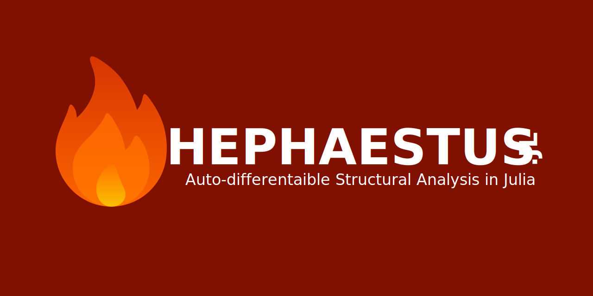

## Description

`Hephaestus.jl` is an auto-differentiable structural analysis package purely written in the Julia programming language.

## Installation

To install `Hephaestus.jl` package, type `]` in Julia REPL to enter the built-in Julia package manager and execute the following command:

```
pkg> add Hephaestus
```

## License

`Hephaestus.jl` package is distributed under the [MIT license](https://en.wikipedia.org/wiki/MIT_License). More information can be found in the [`LICENSE.md`](https://github.com/AkchurinDA/Hephaestus.jl/blob/main/LICENSE.md) file.

## Help and Support

For assistance with the package, please raise an issue on the [GitHub Issues](https://github.com/AkchurinDA/Hephaestus.jl/issues) page. Please use the appropriate labels to indicate the specific functionality you are inquiring about. Alternatively, contact the author directly at [AkchurinDA@gmail.com](mailto:AkchurinDA@gmail.com?subject=Hephaestus.jl).

## Acknowledgements

The design of the package is inspired by [`OpenSeesPy`](https://github.com/zhuminjie/OpenSeesPy), [`PyNite`](https://github.com/JWock82/Pynite), and [`MASTAN2`](https://www.mastan2.com).

## Roadmap

- [ ] Analyses
  - [x] 1nd-order elastic analysis
  - [ ] 2nd-order elastic analysis
  - [ ] Elastic buckling analysis
- [ ] Elements
  - [ ] Truss element
  - [x] Beam-column element (Euler-Bernoulli)
  - [ ] Beam-column element (Timoshenko)